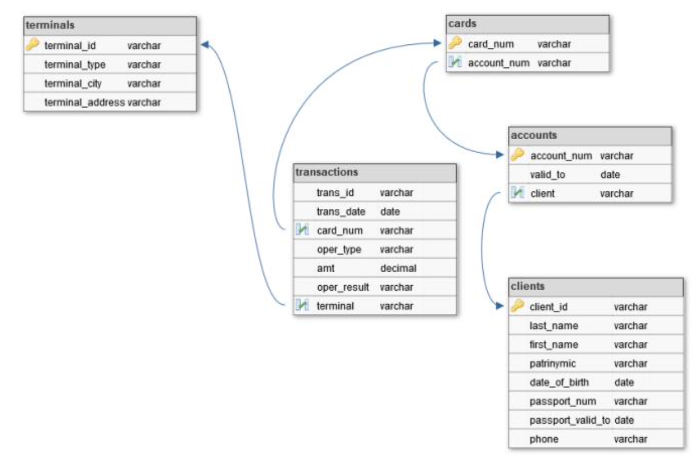

# Проект ETL процесса

## Задание

Задана структура хранилища:  

Необходимо написать процесс загрузки данных в хранилище согласно структуре и строит отчет о выявленных нарушениях. 

Возможные нарушения подразделяются на 4 типа: 

1. У пользователя на момент транзакции просрочен паспорт
2. У пользователя на момент транзакции закончил действие договор
3. Транзакции в течение 1 часа совершены в разных городах
4. В течение 20 минут осуществляется подбор суммы для снятия такой, что совершено три и более транзакций, сумма каждой меньше предыдущей. Все кроме последней отклонены.

## Реализация

Реализована схема, аналогичная заданию: 

Диаграмма движения данных: 

Благодаря триггерам, создается копия данных с технической версионностью. В ней представлены данные без первичных ключей и уникальных полей и имеется 2 дополнительные поля, задающие временной промежуток. 

[Триггеры из реализации.](script/trig.sql)

[Скрипт загрузки данных во временную таблицу.](script/upload.py)

[Скрипт расперделения данных по хранилищу.](script/etl.sql)

Процесс формирования отчета:

## Результат работы

[Пример ведения версионности](dim_clients_hist.md)

[Пример хранения операций во временной таблице](operations.md)

[Полный отчет на предоставленных данных](report.md)

